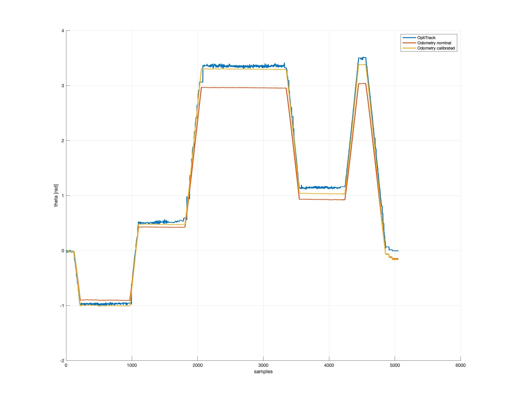

# Robotics project 1

| Name             |    ID    |
| :--------------- | :------: |
| Alberto Nidasio  | 10665344 |
| Matteo Pignataro | 10667498 |
| Paolo Pertino    | 10729600 |

## Introduction
The first robotics project (A.S. 2021/2022) consists in analyzing data coming from wheel-sensors put on an omnidirectional robot with 4 Mecanum wheels with rollers at 45&deg;, by computing the odometry and calibrating the robot parameters to match the Ground Truth pose.

| Matteo Matteucci's robot                             | Meccanum wheels robot diagram                                                    |
| ---------------------------------------------------- | -------------------------------------------------------------------------------- |
|  |  |

## How to use

Extract the compressed archive and copy the project_1 folder into your ros workspace under the /path/to/ros_workspace/src folder. Then, place the bags in /project_1/bags and update the following command in the `odometry_interactive.launch` file:
```
c<node pkg="rosbag" type="play" name="player" args="--loop -r 10 $(find project_1)/bags/YOUR_BAG_NAME.bag" />
```
by replacing `YOUR_BAG_NAME` with the actual names of the bag you have uploaded in the specified folder.


Finally, to execute the launch file run:
```
catkin_make && roslaunch project_1 odometry_interactive.launch
```

## Goals
| Goal                                                                                          |                                                                                              Status                                                                                               |
| :-------------------------------------------------------------------------------------------- | :-----------------------------------------------------------------------------------------------------------------------------------------------------------------------------------------------: |
| Compute odometry using appropriate kinematics                                                 |    [](https://github.com/NidasioAlberto/robotics-2022-nidasio-pignataro-pertino/blob/master/src/project_1/src/shared/OdometryComputer.h)    |
| Compute wheel control speeds from v, ⍵                                                        | [](https://github.com/NidasioAlberto/robotics-2022-nidasio-pignataro-pertino/blob/master/src/project_1/src/shared/WheelsVelocityComputer.h) |
| Use ROS Service to reset the odometry to any pose (x, y, θ)                                   |      [](https://github.com/NidasioAlberto/robotics-2022-nidasio-pignataro-pertino/blob/master/src/project_1/srv/ResetStartingPose.srv)      |
| Use dynamic reconfigure to select between integration method                                  |   [](https://github.com/NidasioAlberto/robotics-2022-nidasio-pignataro-pertino/blob/master/src/project_1/cfg/odometryComputerParams.cfg)    |
| Use dynamic reconfigure to select between wheels data source                                  |   [](https://github.com/NidasioAlberto/robotics-2022-nidasio-pignataro-pertino/blob/master/src/project_1/cfg/velocityComputerParams.cfg)    |
| Use dynamic reconfigure to modify robot physical parameters                                   |   [](https://github.com/NidasioAlberto/robotics-2022-nidasio-pignataro-pertino/blob/master/src/project_1/cfg/velocityComputerParams.cfg)    |
| Initial pose automatically                                   set by using the service created | [](https://github.com/NidasioAlberto/robotics-2022-nidasio-pignataro-pertino/blob/master/src/project_1/src/starting_position_detector.cpp)  |
| Publish Odometry msgs as nav_msgs/Odometry on topic odom                                      |      [](https://github.com/NidasioAlberto/robotics-2022-nidasio-pignataro-pertino/blob/master/src/project_1/src/odometry_computer.cpp)      |
| Broadcast TF world->odom->base_link                                                           |      [](https://github.com/NidasioAlberto/robotics-2022-nidasio-pignataro-pertino/blob/master/src/project_1/src/odometry_computer.cpp)      |


## Brief description of the code

The `C++` code is organized in classes, each in their own header file, and the node `.cpp`.
Every component, such as the robot velocity and odometry calculation was divided in different classes so that each logical element is separated form the actual node implementation.

The header files are:
- `Singleton.h`: A class that simplifies the creation of singletons;
- `VelocityComputer.h`: A class to compute the robot's linear and angular speeds from the 4 wheels speeds (as RPM or ENCODERS) through the method `computeRobotVelocity`;
- `OdometryComputer.h`: A class to compute the robot's position using odometry through the method `computeOdometry`;
- `WheelsVelocityComputer.h`: A class that takes as input the computed velocity and re-calculates the 4 wheels velocities to compare the results. It exposes the method `computeWheelVelocities` to do so.

The nodes are:
- `velocity_computer.cpp`: Node that computes the robot velocity listening to the 4 wheels velocities (Using the `VelocityComputer.h`);
- `odometry_computer.cpp`: Node that computes the odometry listening to the robot velocity (Using the `OdometryComputer.h`);
- `wheels_velocity_computer.cpp`: Node that re-computes the 4 wheels velocities listening to the robot velocity (Using the `WheelsVelocityComputer.h`);
- `starting_position_detector.cpp`: Node that monitors the difference in time of the bag with the last recorded one to detect when the bag has been reset and so register the starting position into the odometry computer;
- `position_comparison.cpp`: Node that listens for OptiTrack position and odometry position and computes the difference.

## Ros parameters

The used ros parameters are:
| Parameter Name           | Description                          | Nominal Values | Calibrated Values |
| :----------------------- | :----------------------------------- | :------------- | :---------------: |
| R                        | Wheels radius [m]                    | 0.07           |     0.075797      |
| L                        | Wheel position along x [m]           | 0.2            |        0.2        |
| W                        | Wheel position along y [m]           | 0.169          |     0.158886      |
| T                        | Gear ratio from motor wheel          | 0.2            |        0.2        |
| N                        | Counts per revolution of the motor   | 42.0           |        42         |
| wheels_speed_data_source | Enumeration of (RPM, ENCODERS)       | -              |     ENCODERS      |
| integration_method       | Enumeration of (EULER, RUNGHE_KUTTA) | -              |   RUNGHE_KUTTA    |

> **_INFO:_** All the default parameters are set after the calibration operation.

## TF tree


## Custom messages

The custom messages are:
- `WheelsRpm`: is the custom message requested to publish the 4 wheels RPMs.

## Parameters calibration

Given the odometry formulas, R, T and N have the same effect, also L and W are always summed together. Considering that the gear ratio and the encoders count should be almost exact, we decided to make the calibration consider R and L + W as parameters to tune.

The calibration process is written in Matlab and is really straight forward. We first exported the bags data to csv files and prepared a function, `odometry_with_tick`, to perform the odometry using the wheels ticks following the same steps used in the `C++` code. The rest of the code reads the bags data and calculates the error between the odometry position and the OptiTrack data using many different parameters values. The error is the sum for every step between odometry and OptiTrack, this way the calibration minimizes the overall distance between the real position and the odometry calculated position.

In the image below the error curve for each bag is shown. The red dot highlights the minimum error.


From the calibration of the 3 bags we averaged the best parameters between bag 2 and 3. The first bag can't be counted mainly because it has only straight movements. The parameters found are:
- R = 0.075797 (+8.3% from nominal)
- L + W = 0.358886 (-2.7% from nominal)

To verify this values we plotted the trajectory and orientation of the odometry with nominal and tuned parameter against the OptiTrack data.

| Bag 2 position comparison                                                | Bag 2 orientation comparison                                                   |
| ------------------------------------------------------------------------ | ------------------------------------------------------------------------------ |
|  |  |

| Bag 3 position comparison                                                | Bag 3 orientation comparison                                                   |
| ------------------------------------------------------------------------ | ------------------------------------------------------------------------------ |
|  |  |
