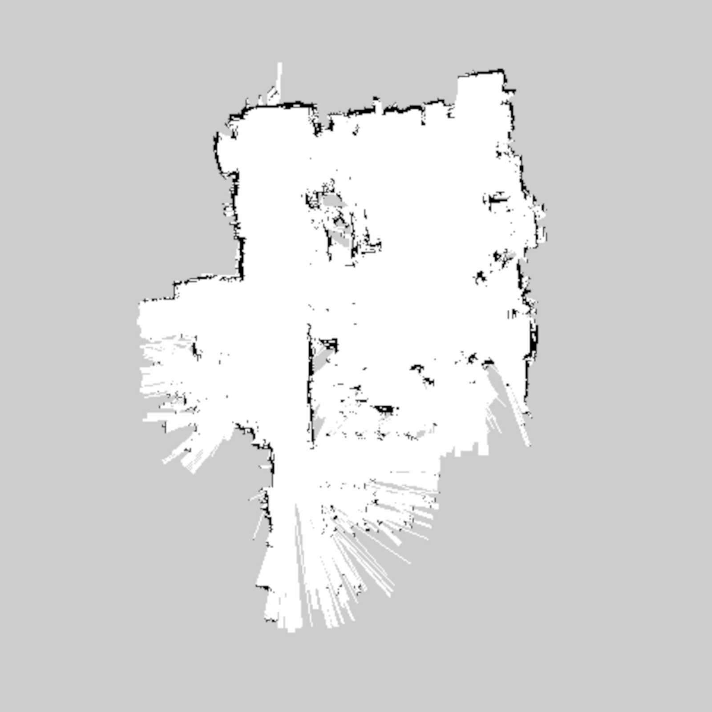
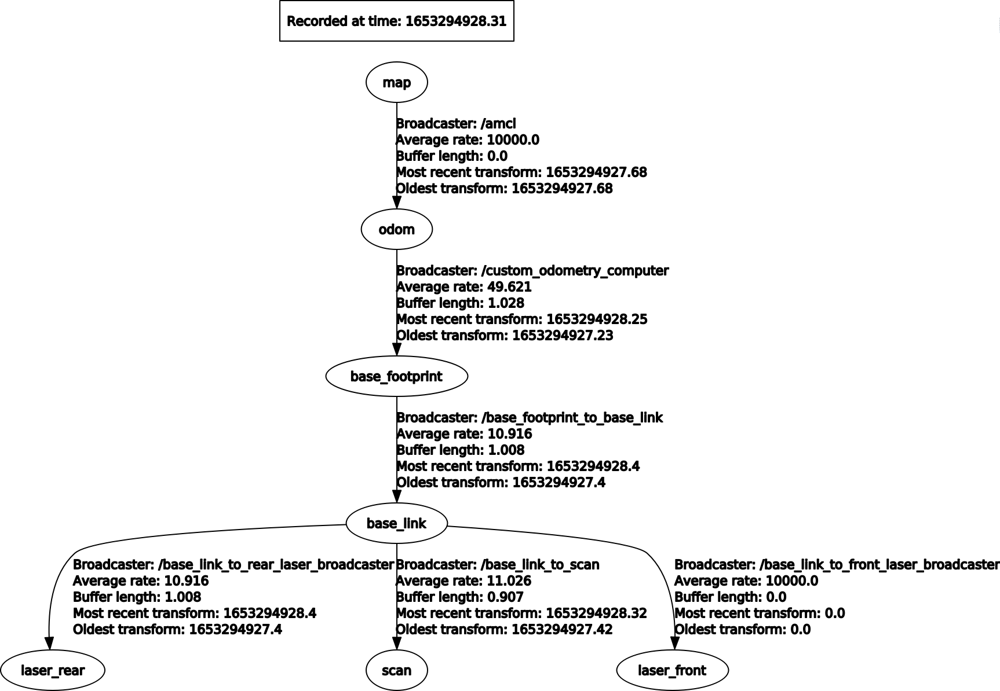

# Robotics project 2

| Name             |    ID    |
| :--------------- | :------: |
| Alberto Nidasio  | 10665344 |
| Matteo Pignataro | 10667498 |
| Paolo Pertino    | 10729600 |

## Introduction

The second robotics project (A.S. 2021/2022) consists in analyzing data coming from laser-sensors (2x YDLIDAR G4) put on an omnidirectional robot with 4 Mecanum wheels with rollers at 45&deg;, to perform a mapping task and a localization task.

| Matteo Matteucci's robot                             | Meccanum wheels robot diagram                                                    |
| ---------------------------------------------------- | -------------------------------------------------------------------------------- |
|  |  |

## How to use

Extract the compressed archive and copy the project_2 folder into your ros workspace under the `/path/to/ros_workspace/src` folder. Then, place the bags in `/project_2/bags` and update the following command in both the `AMCLLocalization.launch` and `GMappingSLAM.launch` file:
```
<node pkg="rosbag" type="play" name="player" args="$(find project_2)/bags/YOUR_BAG_NAME.bag --clock" />
```
by replacing `YOUR_BAG_NAME` with the actual names of the bag you have uploaded in the specified folder.

>**DISCLAIMER**: we used `robotics1_final.bag` to compute the map, and `robotics2_final.bag` & `robotics3_final.bag` for the localization task.


Finally you can proceed by executing the launch files following the steps below.

## Mapping

For the SLAM task we used `GMapping`. We provide, as requested, a launch file to run:
1. Velocity and Odometry computers (from project_1) in order to compute the odometry by directly taking encoders data from the bag.
2. 4 static transform publishers to publish the TF transform for the 2 lidars (`base_link` -> `rear/front lidar`), one for `base_footprint` -> `base_link` and the last one for `base_link` to `scan`.
3. `Laser Scan Multi Merger` (from ira_laser_tools) to merge the scans coming from the rear and front lidars.
4. SLAM Gmapping node with its configuration (see `gmapping.launch.xml`).
5. RViz and the `robotics1_final.bag`.

To run the launch file make sure you have put the bag in the `bags` folder and properly set up its name in the launch file.
Then use:
```
    catkin_make && roslaunch project_2 GMappingSLAM.launch
```

## Localization

For the AMCL localization task we are using `AMCL`. We provide, as requested, a launch file to run:
1. Velocity and Odometry computers (from project_1) in order to compute the odometry by directly taking encoders data from the bag.
2. Trajectory printer node, used to offer the requested service for plotting the trajectory followed by the robot (from start until the service call) on the map and then saving it locally.
3. 4 static transform publishers to publish the TF transform for the 2 lidars (`base_link` -> `rear/front lidar`), one for `base_footprint` -> `base_link` and the last one for `base_link` to `scan`.
4. `Laser Scan Multi Merger` (from ira_laser_tools) to merge the scans coming from the rear and front lidars.
5. Map server to load the map where the robot is moving.
6. AMCL to perferm localization with its parameters (see `amcl.launch.xml`).
7. RViz and the `robotics2_final.bag` (default) or `robotics3_final.bag`.

To run the launch file make sure you have put the bag in the `bags` folder, properly set up its name and finally have successfully set up the map file in the launch file by editing the following command (we provide as default our precomputed map coming from the `robotics1_final.bag` data already set up) changing the map file name:
```
    <arg name="map_file" default="$(find project_2)/maps/map_bag1.yaml"/>
```

Then use:
```
    catkin_make && roslaunch project_2 AMCLLocalization.launch
```

## Goals
| Goal                                                |                                                                 Status                                                                  |
| :-------------------------------------------------- | :-------------------------------------------------------------------------------------------------------------------------------------: |
| SLAM                                                |   [✅](https://github.com/NidasioAlberto/robotics-2022-nidasio-pignataro-pertino/blob/master/src/project_2/launch/GMappingSLAM.launch)   |
| Localization with AMCL                              | [✅](https://github.com/NidasioAlberto/robotics-2022-nidasio-pignataro-pertino/blob/master/src/project_2/launch/AMCLLocalization.launch) |
| Service to save the map with the trajectory plotted |   [✅](https://github.com/NidasioAlberto/robotics-2022-nidasio-pignataro-pertino/blob/master/src/project_2/src/trajectory_printer.cpp)   |


## Brief description of the code

This project was less 'code-oriented' than the last one, but still we managed to write some helper nodes. Below, it follows a brief description:

The header files are:
- `Singleton.h`: A class that simplifies the creation of singletons;
- `VelocityComputer.h`: A class to compute the robot's linear and angular speeds from the 4 wheels speeds through the method `computeRobotVelocity`;
- `OdometryComputer.h`: A class to compute the robot's position using odometry through the method `computeOdometry`;

The nodes are:
- `custom_velocity_computer.cpp`: Node that computes the robot velocity listening to the 4 wheels velocities (Using the `VelocityComputer.h`);
- `custom_odometry_computer.cpp`: Node that computes the odometry listening to the robot velocity (Using the `OdometryComputer.h`) and publish the transformation Odom -> BaseLink;
- `tf_tree_computer.cpp`: Node used only when using the odometry provided with the bag files (by default we use the nodes described before which come from the project_1);
- `trajectory_printer.cpp`: Node which creates the service to save the map with the trajectory followed by the robot (from start until the service call) plotted on it.

## Folder Structure
```
├── assets // Images used in this report
│   ├── Meccanum wheels robot diagram.png
│   ├── MM's robot.png
│   └── tftree.png
├── bags   // Bag folder. Put your bags here.
│   ├── robotics1_final.bag
│   ├── robotics2_final.bag
│   └── robotics3_final.bag
├── cfg    // Config folder, for AMCL and GMapping configuration.
│   ├── amcl.launch.xml
│   └── gmapping.launch.xml
├── CMakeLists.txt
├── launch // Folder containing the launch files.
│   ├── AMCLLocalization.launch
│   └── GMappingSLAM.launch
├── maps   // Folder for map img/yaml (for localization task).
│   ├── map_bag1.pgm
│   └── map_bag1.yaml
├── package.xml
├── README.md
├── robot_trajectory // Folder in which the map+trajectory is saved.
│   └── Trajectories Recorded in Testing
│       ├── map_with_trajectoryBAG2.png
│       └── map_with_trajectory_BAG3.png
├── rviz // Folder for RViz configurations
│   ├── rvizLocalizationConfig.rviz
│   └── rvizSLAMConfig.rviz
├── src  // Folder which contains all our nodes.
│   ├── custom_odometry_computer.cpp
│   ├── custom_velocity_computer.cpp
│   ├── shared
│   │   ├── OdometryComputer.h
│   │   ├── Singleton.h
│   │   └── VelocityComputer.h
│   ├── tf_tree_computer.cpp
│   └── trajectory_printer.cpp
└── srv  // Service folder.
    └── SaveRobotTrajectory.srv
```
## Images
| Map created with GMapping                          | Bag 1 trajectory                                                                                          |
| -------------------------------------------------- | --------------------------------------------------------------------------------------------------------- |
|  |  |

| Bag 2 trajectory                                                                                          | Bag 3 trajectory                                                                                          |
| --------------------------------------------------------------------------------------------------------- | --------------------------------------------------------------------------------------------------------- |
|  |  |

## TF tree


## Trajectory printing
The idea behind the trajectory drawing technique is to listen for robot position and for map updates. Once the service is called, the method `saveMapWithTrajectory` is called and the first thing that it does is to convert the map created so far into a `cv::Mat` matrix. After the map has been created, for every robot position (all the positions are saved during the processing) if it is the first position, it draws a point, else it draws a line between the current examined position and the previous one. Once the trajectory drawing is complete, it saves the matrix as an image inside the `robot_trajectory` directory.

Here are some relevant info:
 - `occupancyGridToCvMat`: it defines 3 main colors (black, white and grey). With these colors, this method parses all the 1600x1600 occupancy grid matrix and for every cell it sets inside the `cv::Mat` the corresponding black, white or grey pixel depending on the cell occupancy status;
 - `pixel retrieve from map and robot trajectory coordinates` the conversion is done by performing a translation of the robot position with the map origin position and divinding this relative position with the map resolution.

## Useful readings
[Paper for GMapping tuning 1](https://www.politesi.polimi.it/bitstream/10589/164687/3/A%20Review%20of%202D%20SLAM%20Algorithms%20on%20ROS.pdf)

[Paper for GMapping tuning 2](https://www.researchgate.net/publication/341874647_Optimization_of_SLAM_Gmapping_based_on_Simulation)